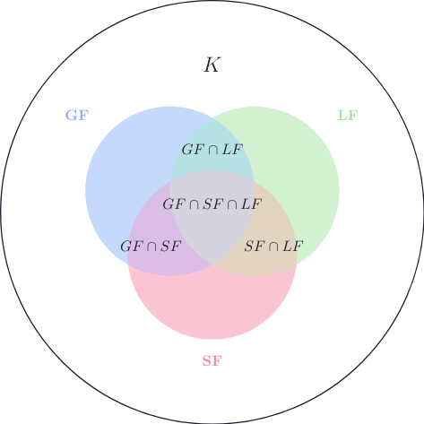

# Multifunction to the Category of Sets (\\(\mathbf{Mol} \to \mathbf{Set}\\))

We define a **multifunctor**

$$
F : \mathbf{Mol} \to \mathbf{Set}
$$

All objects from \\(\mathbf{Mol}\\) are mapped to singleton sets:

$$
F(\mathsf{H_2O}) = \\{ \mathsf{H_2O} \\}
$$

$$
F(\mathsf{CO_2}) = \\{ \mathsf{CO_2} \\}
$$

$$
\cdots
$$

In the category \\(\mathbf{Set}\\), there always exists a set of all molecules:

$$
K = \bigcup_{m \in \mathrm{Ob}(\mathbf{Mol})} F(m), \quad K \in \mathbf{Set}
$$

Each morphism

\\(f: (X_1, \dots, X_n) \to Y\\) in \\(\mathbf{Mol}\\) is mapped to a function:

$$
F(f): F(X_1) \times \dots \times F(X_n) \to F(Y)
$$

These functions don't contain interesting dynamics, but the functor \\(F\\) itself allows us to define the **set of all molecules** \\(K\\), which can then be used as a basis for further mappings.

$$
\mathsf{H_2O} \in K
$$

Note that molecules like \\(2H_2O\\) do **not** exist in this set:

$$
\mathsf{2H_2O} \notin K
$$

Let’s define the **set of all chemical elements** \\(E\\):

$$
E \subset K
$$

$$
\mathsf{H} \in E
$$

$$
\mathsf{H_2O} \notin E
$$

Now we introduce subsets for different categories of elements, such as metals and nonmetals:

- \\(NM\\): set of nonmetals

$$
NM \subset E
$$

$$
\\{ \mathsf{H}, \mathsf{C}, \mathsf{N}, \mathsf{O} \\} \subset NM
$$

- \\(HM\\): set of metalloids (semi-metals)

$$
HM \subset E
$$

- \\(M\\): set of metals

$$
M \subset E
$$

$$
\mathsf{Ti} \in M
$$

We assume:

$$
NM \cap M = \emptyset
$$

$$
HM \cap M = \emptyset
$$

$$
HM \cap NM = \emptyset
$$

Metals can also be divided into more specific categories:

- \\(M_A\\): alkali metals

$$
M_A \subset M
$$

$$
\mathsf{Na} \in M_A
$$

Alternatively defined as (first group elements excluding hydrogen):

$$
M_A = \\{e \in E \mid G(e) = 1\\} \setminus \\{\mathsf{H}\\} = \\{ \mathsf{Li}, \mathsf{Na}, \mathsf{K}, \mathsf{Rb}, \mathsf{Cs}, \mathsf{Fr} \\}
$$

Here, the function \\(G\\) (described below) maps each element to its group in the periodic table.

- \\(M_{AE}\\): alkaline earth metals

$$
M_{AE} \subset M
$$

$$
M_{AE} = \\{ e \in E \mid G(e) = 2 \\} = \\{ \mathsf{Be}, \mathsf{Mg}, \mathsf{Ca}, \mathsf{Sr}, \mathsf{Ba}, \mathsf{Ra} \\}
$$

Other metal categories:

- Transition metals: \\(M_T \subset M\\)
- Lanthanides: \\(M_L \subset M\\)
- Actinides: \\(M_{AC} \subset M\\)
- Post-transition metals: \\(M_{PT} \subset M\\)

<?xml version="1.0" encoding="UTF-8"?>
<svg xmlns="http://www.w3.org/2000/svg" xmlns:xlink="http://www.w3.org/1999/xlink" width="340.954pt" height="340.954pt" viewBox="0 0 340.954 340.954">
<defs>
<g>
<g id="glyph-0-0">
<path d="M 5.078125 -4.03125 C 5.0625 -4.0625 5.03125 -4.140625 5.03125 -4.171875 C 5.03125 -4.171875 5.203125 -4.3125 5.3125 -4.390625 L 7.0625 -5.734375 C 8 -6.4375 8.390625 -6.46875 8.6875 -6.5 C 8.765625 -6.515625 8.859375 -6.515625 8.859375 -6.703125 C 8.859375 -6.734375 8.828125 -6.8125 8.75 -6.8125 C 8.53125 -6.8125 8.28125 -6.78125 8.046875 -6.78125 C 7.6875 -6.78125 7.296875 -6.8125 6.9375 -6.8125 C 6.875 -6.8125 6.75 -6.8125 6.75 -6.609375 C 6.75 -6.546875 6.796875 -6.515625 6.875 -6.5 C 7.09375 -6.484375 7.171875 -6.4375 7.171875 -6.296875 C 7.171875 -6.109375 6.875 -5.875 6.8125 -5.828125 L 2.9375 -2.84375 L 3.734375 -6.046875 C 3.8125 -6.40625 3.84375 -6.5 4.5625 -6.5 C 4.8125 -6.5 4.90625 -6.5 4.90625 -6.703125 C 4.90625 -6.78125 4.828125 -6.8125 4.765625 -6.8125 C 4.484375 -6.8125 3.765625 -6.78125 3.484375 -6.78125 C 3.203125 -6.78125 2.5 -6.8125 2.203125 -6.8125 C 2.140625 -6.8125 2 -6.8125 2 -6.625 C 2 -6.5 2.09375 -6.5 2.296875 -6.5 C 2.421875 -6.5 2.609375 -6.484375 2.71875 -6.484375 C 2.875 -6.453125 2.9375 -6.4375 2.9375 -6.3125 C 2.9375 -6.28125 2.9375 -6.25 2.90625 -6.125 L 1.5625 -0.78125 C 1.46875 -0.390625 1.453125 -0.3125 0.65625 -0.3125 C 0.484375 -0.3125 0.375 -0.3125 0.375 -0.125 C 0.375 0 0.5 0 0.53125 0 C 0.8125 0 1.515625 -0.03125 1.796875 -0.03125 C 2 -0.03125 2.21875 -0.015625 2.4375 -0.015625 C 2.65625 -0.015625 2.875 0 3.078125 0 C 3.15625 0 3.28125 0 3.28125 -0.203125 C 3.28125 -0.3125 3.1875 -0.3125 3 -0.3125 C 2.625 -0.3125 2.359375 -0.3125 2.359375 -0.484375 C 2.359375 -0.5625 2.40625 -0.78125 2.4375 -0.921875 C 2.578125 -1.453125 2.71875 -1.96875 2.84375 -2.5 L 4.328125 -3.65625 L 5.484375 -0.96875 C 5.609375 -0.703125 5.609375 -0.671875 5.609375 -0.625 C 5.609375 -0.3125 5.171875 -0.3125 5.078125 -0.3125 C 4.96875 -0.3125 4.859375 -0.3125 4.859375 -0.109375 C 4.859375 0 4.984375 0 5 0 C 5.40625 0 5.828125 -0.03125 6.21875 -0.03125 C 6.4375 -0.03125 6.984375 0 7.203125 0 C 7.25 0 7.375 0 7.375 -0.203125 C 7.375 -0.3125 7.265625 -0.3125 7.171875 -0.3125 C 6.765625 -0.3125 6.640625 -0.40625 6.484375 -0.75 Z M 5.078125 -4.03125 "/>
</g>
<g id="glyph-0-1">
<path d="M 7.0625 -2.328125 C 7.078125 -2.375 7.109375 -2.4375 7.109375 -2.46875 C 7.109375 -2.46875 7.109375 -2.578125 6.984375 -2.578125 C 6.890625 -2.578125 6.875 -2.515625 6.859375 -2.453125 C 6.203125 -0.984375 5.84375 -0.3125 4.140625 -0.3125 L 2.6875 -0.3125 C 2.546875 -0.3125 2.515625 -0.3125 2.46875 -0.3125 C 2.359375 -0.328125 2.328125 -0.34375 2.328125 -0.421875 C 2.328125 -0.453125 2.328125 -0.46875 2.375 -0.640625 L 3.0625 -3.375 L 4.046875 -3.375 C 4.890625 -3.375 4.890625 -3.15625 4.890625 -2.90625 C 4.890625 -2.84375 4.890625 -2.71875 4.828125 -2.421875 C 4.8125 -2.375 4.796875 -2.34375 4.796875 -2.3125 C 4.796875 -2.265625 4.828125 -2.203125 4.921875 -2.203125 C 5 -2.203125 5.03125 -2.25 5.078125 -2.40625 L 5.640625 -4.734375 C 5.640625 -4.796875 5.59375 -4.84375 5.515625 -4.84375 C 5.4375 -4.84375 5.40625 -4.78125 5.390625 -4.671875 C 5.171875 -3.90625 5 -3.671875 4.078125 -3.671875 L 3.140625 -3.671875 L 3.734375 -6.078125 C 3.828125 -6.4375 3.84375 -6.46875 4.28125 -6.46875 L 5.6875 -6.46875 C 6.890625 -6.46875 7.203125 -6.1875 7.203125 -5.359375 C 7.203125 -5.125 7.203125 -5.109375 7.15625 -4.828125 C 7.15625 -4.78125 7.140625 -4.703125 7.140625 -4.65625 C 7.140625 -4.609375 7.171875 -4.53125 7.265625 -4.53125 C 7.375 -4.53125 7.390625 -4.59375 7.40625 -4.78125 L 7.609375 -6.515625 C 7.640625 -6.78125 7.59375 -6.78125 7.34375 -6.78125 L 2.296875 -6.78125 C 2.109375 -6.78125 2 -6.78125 2 -6.578125 C 2 -6.46875 2.09375 -6.46875 2.28125 -6.46875 C 2.65625 -6.46875 2.9375 -6.46875 2.9375 -6.296875 C 2.9375 -6.25 2.9375 -6.234375 2.875 -6.046875 L 1.5625 -0.78125 C 1.46875 -0.390625 1.453125 -0.3125 0.65625 -0.3125 C 0.484375 -0.3125 0.375 -0.3125 0.375 -0.125 C 0.375 0 0.46875 0 0.65625 0 L 5.828125 0 C 6.0625 0 6.078125 -0.015625 6.140625 -0.171875 Z M 7.0625 -2.328125 "/>
</g>
<g id="glyph-0-2">
<path d="M 7.53125 -5.765625 C 7.640625 -6.15625 7.8125 -6.46875 8.609375 -6.5 C 8.65625 -6.5 8.78125 -6.515625 8.78125 -6.703125 C 8.78125 -6.703125 8.78125 -6.8125 8.65625 -6.8125 C 8.328125 -6.8125 7.96875 -6.78125 7.640625 -6.78125 C 7.3125 -6.78125 6.953125 -6.8125 6.625 -6.8125 C 6.5625 -6.8125 6.453125 -6.8125 6.453125 -6.609375 C 6.453125 -6.5 6.546875 -6.5 6.625 -6.5 C 7.203125 -6.484375 7.3125 -6.28125 7.3125 -6.0625 C 7.3125 -6.03125 7.28125 -5.875 7.28125 -5.859375 L 6.15625 -1.421875 L 3.953125 -6.625 C 3.875 -6.796875 3.875 -6.8125 3.640625 -6.8125 L 2.296875 -6.8125 C 2.109375 -6.8125 2.015625 -6.8125 2.015625 -6.609375 C 2.015625 -6.5 2.109375 -6.5 2.296875 -6.5 C 2.34375 -6.5 2.96875 -6.5 2.96875 -6.40625 L 1.640625 -1.0625 C 1.53125 -0.65625 1.359375 -0.34375 0.5625 -0.3125 C 0.5 -0.3125 0.390625 -0.296875 0.390625 -0.109375 C 0.390625 -0.046875 0.4375 0 0.515625 0 C 0.84375 0 1.1875 -0.03125 1.515625 -0.03125 C 1.859375 -0.03125 2.21875 0 2.546875 0 C 2.59375 0 2.71875 0 2.71875 -0.203125 C 2.71875 -0.296875 2.625 -0.3125 2.515625 -0.3125 C 1.9375 -0.328125 1.859375 -0.546875 1.859375 -0.75 C 1.859375 -0.8125 1.875 -0.875 1.90625 -0.984375 L 3.21875 -6.234375 C 3.265625 -6.1875 3.265625 -6.15625 3.3125 -6.0625 L 5.796875 -0.1875 C 5.859375 -0.015625 5.890625 0 5.984375 0 C 6.09375 0 6.09375 -0.03125 6.140625 -0.203125 Z M 7.53125 -5.765625 "/>
</g>
<g id="glyph-0-3">
<path d="M 9.234375 -6.046875 C 9.328125 -6.40625 9.34375 -6.5 10.09375 -6.5 C 10.3125 -6.5 10.40625 -6.5 10.40625 -6.703125 C 10.40625 -6.8125 10.3125 -6.8125 10.140625 -6.8125 L 8.828125 -6.8125 C 8.5625 -6.8125 8.546875 -6.8125 8.4375 -6.625 L 4.796875 -0.9375 L 4.015625 -6.578125 C 3.984375 -6.8125 3.96875 -6.8125 3.703125 -6.8125 L 2.34375 -6.8125 C 2.15625 -6.8125 2.046875 -6.8125 2.046875 -6.625 C 2.046875 -6.5 2.140625 -6.5 2.328125 -6.5 C 2.46875 -6.5 2.640625 -6.484375 2.765625 -6.484375 C 2.921875 -6.453125 2.984375 -6.4375 2.984375 -6.3125 C 2.984375 -6.28125 2.96875 -6.25 2.9375 -6.125 L 1.671875 -1.0625 C 1.578125 -0.65625 1.40625 -0.34375 0.59375 -0.3125 C 0.546875 -0.3125 0.421875 -0.296875 0.421875 -0.125 C 0.421875 -0.03125 0.484375 0 0.5625 0 C 0.875 0 1.21875 -0.03125 1.5625 -0.03125 C 1.890625 -0.03125 2.25 0 2.578125 0 C 2.625 0 2.765625 0 2.765625 -0.203125 C 2.765625 -0.3125 2.65625 -0.3125 2.578125 -0.3125 C 2.015625 -0.3125 1.90625 -0.515625 1.90625 -0.75 C 1.90625 -0.8125 1.90625 -0.875 1.9375 -0.984375 L 3.296875 -6.40625 L 3.3125 -6.40625 L 4.171875 -0.234375 C 4.1875 -0.109375 4.203125 0 4.3125 0 C 4.421875 0 4.484375 -0.109375 4.53125 -0.171875 L 8.5625 -6.484375 L 8.578125 -6.484375 L 7.140625 -0.78125 C 7.046875 -0.390625 7.03125 -0.3125 6.234375 -0.3125 C 6.078125 -0.3125 5.96875 -0.3125 5.96875 -0.125 C 5.96875 0 6.078125 0 6.109375 0 C 6.390625 0 7.0625 -0.03125 7.34375 -0.03125 C 7.75 -0.03125 8.1875 0 8.59375 0 C 8.65625 0 8.78125 0 8.78125 -0.203125 C 8.78125 -0.3125 8.6875 -0.3125 8.5 -0.3125 C 8.140625 -0.3125 7.859375 -0.3125 7.859375 -0.484375 C 7.859375 -0.53125 7.859375 -0.546875 7.90625 -0.734375 Z M 9.234375 -6.046875 "/>
</g>
<g id="glyph-0-4">
<path d="M 7.609375 -6.046875 C 7.703125 -6.40625 7.71875 -6.5 8.4375 -6.5 C 8.703125 -6.5 8.78125 -6.5 8.78125 -6.703125 C 8.78125 -6.8125 8.671875 -6.8125 8.640625 -6.8125 C 8.359375 -6.8125 7.640625 -6.78125 7.359375 -6.78125 C 7.078125 -6.78125 6.375 -6.8125 6.078125 -6.8125 C 6 -6.8125 5.890625 -6.8125 5.890625 -6.609375 C 5.890625 -6.5 5.984375 -6.5 6.171875 -6.5 C 6.1875 -6.5 6.375 -6.5 6.546875 -6.484375 C 6.734375 -6.453125 6.8125 -6.453125 6.8125 -6.3125 C 6.8125 -6.28125 6.8125 -6.265625 6.78125 -6.125 L 6.1875 -3.703125 L 3.140625 -3.703125 L 3.734375 -6.046875 C 3.8125 -6.40625 3.84375 -6.5 4.5625 -6.5 C 4.828125 -6.5 4.90625 -6.5 4.90625 -6.703125 C 4.90625 -6.8125 4.796875 -6.8125 4.765625 -6.8125 C 4.484375 -6.8125 3.765625 -6.78125 3.484375 -6.78125 C 3.203125 -6.78125 2.5 -6.8125 2.203125 -6.8125 C 2.125 -6.8125 2.015625 -6.8125 2.015625 -6.609375 C 2.015625 -6.5 2.109375 -6.5 2.296875 -6.5 C 2.3125 -6.5 2.5 -6.5 2.671875 -6.484375 C 2.84375 -6.453125 2.9375 -6.453125 2.9375 -6.3125 C 2.9375 -6.28125 2.9375 -6.25 2.90625 -6.125 L 1.5625 -0.78125 C 1.46875 -0.390625 1.453125 -0.3125 0.65625 -0.3125 C 0.484375 -0.3125 0.390625 -0.3125 0.390625 -0.109375 C 0.390625 0 0.515625 0 0.53125 0 C 0.8125 0 1.515625 -0.03125 1.796875 -0.03125 C 2 -0.03125 2.21875 -0.015625 2.4375 -0.015625 C 2.65625 -0.015625 2.875 0 3.078125 0 C 3.15625 0 3.28125 0 3.28125 -0.203125 C 3.28125 -0.3125 3.1875 -0.3125 3 -0.3125 C 2.625 -0.3125 2.359375 -0.3125 2.359375 -0.484375 C 2.359375 -0.546875 2.375 -0.59375 2.375 -0.65625 L 3.0625 -3.390625 L 6.09375 -3.390625 C 5.6875 -1.734375 5.453125 -0.78125 5.40625 -0.640625 C 5.3125 -0.3125 5.125 -0.3125 4.5 -0.3125 C 4.359375 -0.3125 4.265625 -0.3125 4.265625 -0.109375 C 4.265625 0 4.390625 0 4.40625 0 C 4.6875 0 5.390625 -0.03125 5.671875 -0.03125 C 5.875 -0.03125 6.09375 -0.015625 6.3125 -0.015625 C 6.53125 -0.015625 6.75 0 6.953125 0 C 7.03125 0 7.15625 0 7.15625 -0.203125 C 7.15625 -0.3125 7.0625 -0.3125 6.875 -0.3125 C 6.515625 -0.3125 6.234375 -0.3125 6.234375 -0.484375 C 6.234375 -0.546875 6.25 -0.59375 6.265625 -0.65625 Z M 7.609375 -6.046875 "/>
</g>
<g id="glyph-1-0">
<path d="M 7.109375 -4.1875 C 7.171875 -4.453125 7.1875 -4.515625 7.703125 -4.515625 C 7.859375 -4.515625 7.9375 -4.515625 7.9375 -4.65625 C 7.9375 -4.765625 7.859375 -4.765625 7.734375 -4.765625 L 6.78125 -4.765625 C 6.578125 -4.765625 6.578125 -4.75 6.484375 -4.625 L 3.796875 -0.640625 L 3.109375 -4.578125 C 3.078125 -4.75 3.078125 -4.765625 2.859375 -4.765625 L 1.875 -4.765625 C 1.734375 -4.765625 1.640625 -4.765625 1.640625 -4.609375 C 1.640625 -4.515625 1.71875 -4.515625 1.875 -4.515625 C 1.984375 -4.515625 2.015625 -4.515625 2.140625 -4.5 C 2.28125 -4.484375 2.296875 -4.46875 2.296875 -4.390625 C 2.296875 -4.390625 2.296875 -4.34375 2.265625 -4.25 L 1.390625 -0.75 C 1.328125 -0.515625 1.21875 -0.265625 0.65625 -0.25 C 0.609375 -0.25 0.515625 -0.25 0.515625 -0.09375 C 0.515625 -0.09375 0.515625 0 0.625 0 C 0.828125 0 1.125 -0.03125 1.34375 -0.03125 C 1.515625 -0.03125 1.921875 0 2.078125 0 C 2.125 0 2.21875 0 2.21875 -0.15625 C 2.21875 -0.25 2.125 -0.25 2.0625 -0.25 C 1.625 -0.265625 1.625 -0.453125 1.625 -0.546875 C 1.625 -0.578125 1.625 -0.609375 1.65625 -0.71875 L 2.578125 -4.421875 L 3.328125 -0.1875 C 3.359375 -0.0625 3.359375 0 3.46875 0 C 3.5625 0 3.625 -0.078125 3.671875 -0.15625 L 6.59375 -4.5 L 6.609375 -4.484375 L 5.625 -0.546875 C 5.5625 -0.3125 5.546875 -0.25 5.015625 -0.25 C 4.890625 -0.25 4.796875 -0.25 4.796875 -0.09375 C 4.796875 -0.09375 4.796875 0 4.90625 0 C 5.046875 0 5.203125 -0.015625 5.34375 -0.015625 C 5.484375 -0.015625 5.640625 -0.03125 5.78125 -0.03125 C 5.984375 -0.03125 6.46875 0 6.671875 0 C 6.703125 0 6.8125 0 6.8125 -0.15625 C 6.8125 -0.25 6.734375 -0.25 6.59375 -0.25 C 6.578125 -0.25 6.453125 -0.25 6.328125 -0.265625 C 6.171875 -0.28125 6.171875 -0.296875 6.171875 -0.375 C 6.171875 -0.40625 6.1875 -0.484375 6.1875 -0.515625 Z M 7.109375 -4.1875 "/>
</g>
<g id="glyph-2-0">
<path d="M 3.625 -3.4375 C 3.609375 -3.53125 3.578125 -3.5625 3.46875 -3.5625 C 3.359375 -3.5625 3.328125 -3.53125 3.28125 -3.453125 L 1.328125 -0.625 C 1.109375 -0.3125 0.9375 -0.234375 0.609375 -0.21875 C 0.515625 -0.21875 0.515625 -0.09375 0.515625 -0.078125 C 0.515625 -0.015625 0.578125 0 0.59375 0 C 0.671875 0 0.75 -0.015625 0.828125 -0.015625 C 0.90625 -0.015625 0.984375 -0.015625 1.078125 -0.015625 C 1.171875 -0.015625 1.265625 -0.015625 1.34375 -0.015625 C 1.4375 -0.015625 1.546875 0 1.640625 0 C 1.671875 0 1.75 0 1.75 -0.140625 C 1.75 -0.21875 1.6875 -0.21875 1.65625 -0.21875 C 1.625 -0.21875 1.421875 -0.234375 1.421875 -0.359375 C 1.421875 -0.40625 1.484375 -0.5 1.515625 -0.546875 L 1.890625 -1.078125 C 1.90625 -1.109375 1.90625 -1.109375 2.015625 -1.109375 L 3.515625 -1.109375 C 3.53125 -1.0625 3.53125 -1.03125 3.546875 -0.96875 C 3.5625 -0.875 3.65625 -0.390625 3.65625 -0.328125 C 3.65625 -0.21875 3.34375 -0.21875 3.328125 -0.21875 C 3.25 -0.21875 3.171875 -0.21875 3.171875 -0.078125 C 3.171875 -0.03125 3.203125 0 3.265625 0 C 3.359375 0 3.484375 -0.015625 3.59375 -0.015625 C 3.71875 -0.015625 3.828125 -0.015625 3.953125 -0.015625 C 4.046875 -0.015625 4.15625 -0.015625 4.265625 -0.015625 C 4.359375 -0.015625 4.484375 0 4.578125 0 C 4.671875 0 4.703125 -0.0625 4.703125 -0.140625 C 4.703125 -0.21875 4.625 -0.21875 4.546875 -0.21875 C 4.21875 -0.21875 4.21875 -0.265625 4.203125 -0.375 Z M 3.171875 -2.953125 L 3.484375 -1.34375 L 2.0625 -1.34375 Z M 3.171875 -2.953125 "/>
</g>
<g id="glyph-2-1">
<path d="M 4.59375 -1.1875 C 4.609375 -1.203125 4.625 -1.25 4.625 -1.265625 C 4.625 -1.296875 4.609375 -1.359375 4.53125 -1.359375 C 4.453125 -1.359375 4.453125 -1.34375 4.390625 -1.21875 C 4.03125 -0.453125 3.75 -0.21875 2.859375 -0.21875 L 1.859375 -0.21875 C 1.8125 -0.21875 1.75 -0.21875 1.703125 -0.234375 C 1.703125 -0.28125 1.703125 -0.28125 1.71875 -0.328125 L 2.046875 -1.640625 L 2.6875 -1.640625 C 3.171875 -1.640625 3.1875 -1.5625 3.1875 -1.40625 C 3.1875 -1.359375 3.1875 -1.3125 3.15625 -1.1875 C 3.15625 -1.171875 3.15625 -1.15625 3.15625 -1.140625 C 3.15625 -1.140625 3.15625 -1.0625 3.25 -1.0625 C 3.328125 -1.0625 3.34375 -1.09375 3.359375 -1.171875 L 3.65625 -2.296875 C 3.65625 -2.3125 3.65625 -2.34375 3.65625 -2.375 C 3.65625 -2.390625 3.640625 -2.453125 3.5625 -2.453125 C 3.46875 -2.453125 3.46875 -2.421875 3.4375 -2.34375 C 3.328125 -1.9375 3.171875 -1.875 2.703125 -1.875 L 2.09375 -1.875 L 2.375 -3 C 2.421875 -3.15625 2.421875 -3.15625 2.625 -3.15625 L 3.59375 -3.15625 C 4.3125 -3.15625 4.515625 -3.046875 4.515625 -2.515625 C 4.515625 -2.453125 4.5 -2.359375 4.5 -2.28125 C 4.5 -2.21875 4.546875 -2.1875 4.609375 -2.1875 C 4.703125 -2.1875 4.703125 -2.234375 4.71875 -2.328125 L 4.796875 -3.21875 L 4.8125 -3.296875 C 4.8125 -3.390625 4.734375 -3.390625 4.640625 -3.390625 L 1.546875 -3.390625 C 1.453125 -3.390625 1.375 -3.390625 1.375 -3.25 C 1.375 -3.15625 1.4375 -3.15625 1.5625 -3.15625 C 1.609375 -3.15625 1.78125 -3.15625 1.875 -3.125 C 1.875 -3.078125 1.875 -3.0625 1.859375 -3 L 1.21875 -0.40625 C 1.171875 -0.265625 1.171875 -0.21875 0.78125 -0.21875 C 0.65625 -0.21875 0.578125 -0.21875 0.578125 -0.078125 C 0.578125 0 0.65625 0 0.75 0 L 3.921875 0 C 4.046875 0 4.046875 0 4.09375 -0.09375 Z M 4.59375 -1.1875 "/>
</g>
<g id="glyph-2-2">
<path d="M 2.890625 -2.96875 C 2.9375 -3.125 2.9375 -3.140625 3.140625 -3.140625 L 3.671875 -3.140625 C 4.234375 -3.140625 4.3125 -2.984375 4.3125 -2.671875 C 4.3125 -2.640625 4.3125 -2.546875 4.265625 -2.3125 L 4.265625 -2.265625 C 4.265625 -2.21875 4.296875 -2.171875 4.375 -2.171875 C 4.46875 -2.171875 4.46875 -2.21875 4.484375 -2.3125 L 4.609375 -3.203125 C 4.625 -3.25 4.625 -3.265625 4.625 -3.28125 C 4.625 -3.359375 4.546875 -3.359375 4.453125 -3.359375 L 0.96875 -3.359375 C 0.828125 -3.359375 0.828125 -3.359375 0.78125 -3.265625 L 0.453125 -2.34375 C 0.453125 -2.328125 0.421875 -2.265625 0.421875 -2.265625 C 0.421875 -2.234375 0.453125 -2.171875 0.53125 -2.171875 C 0.609375 -2.171875 0.625 -2.1875 0.65625 -2.3125 C 0.890625 -2.90625 1.03125 -3.140625 1.703125 -3.140625 L 2.25 -3.140625 C 2.28125 -3.140625 2.359375 -3.140625 2.40625 -3.125 L 2.40625 -3.09375 L 1.734375 -0.4375 C 1.703125 -0.28125 1.6875 -0.21875 1.15625 -0.21875 L 1.046875 -0.21875 C 0.953125 -0.21875 0.9375 -0.21875 0.921875 -0.203125 C 0.890625 -0.171875 0.875 -0.125 0.875 -0.078125 C 0.875 -0.0625 0.890625 0 0.96875 0 C 1.125 0 1.28125 -0.015625 1.4375 -0.015625 C 1.578125 -0.015625 1.734375 -0.015625 1.890625 -0.015625 C 2.046875 -0.015625 2.21875 -0.015625 2.375 -0.015625 C 2.53125 -0.015625 2.6875 0 2.84375 0 C 2.875 0 2.96875 0 2.96875 -0.140625 C 2.96875 -0.21875 2.890625 -0.21875 2.8125 -0.21875 L 2.703125 -0.21875 C 2.5625 -0.21875 2.4375 -0.21875 2.296875 -0.25 C 2.265625 -0.25 2.234375 -0.265625 2.234375 -0.3125 C 2.234375 -0.34375 2.234375 -0.34375 2.25 -0.421875 Z M 2.890625 -2.96875 "/>
</g>
<g id="glyph-2-3">
<path d="M 2.375 -2.984375 C 2.40625 -3.109375 2.4375 -3.140625 2.5625 -3.15625 C 2.703125 -3.1875 2.796875 -3.1875 2.9375 -3.1875 C 3.078125 -3.1875 3.15625 -3.1875 3.15625 -3.3125 C 3.15625 -3.375 3.109375 -3.40625 3.0625 -3.40625 C 2.921875 -3.40625 2.78125 -3.390625 2.65625 -3.390625 C 2.515625 -3.390625 2.375 -3.390625 2.25 -3.390625 C 2.109375 -3.390625 1.984375 -3.390625 1.859375 -3.390625 C 1.75 -3.390625 1.609375 -3.40625 1.5 -3.40625 C 1.46875 -3.40625 1.375 -3.40625 1.375 -3.265625 C 1.375 -3.1875 1.453125 -3.1875 1.5625 -3.1875 C 1.609375 -3.1875 1.78125 -3.1875 1.890625 -3.15625 C 1.890625 -3.09375 1.890625 -3.078125 1.875 -3.03125 L 1.21875 -0.40625 C 1.171875 -0.265625 1.171875 -0.21875 0.796875 -0.21875 C 0.65625 -0.21875 0.578125 -0.21875 0.578125 -0.078125 C 0.578125 0 0.65625 0 0.75 0 L 3.578125 0 C 3.703125 0 3.703125 0 3.75 -0.109375 C 3.796875 -0.25 4.203125 -1.234375 4.203125 -1.265625 C 4.203125 -1.3125 4.171875 -1.359375 4.09375 -1.359375 C 4.015625 -1.359375 4.015625 -1.34375 3.953125 -1.21875 C 3.6875 -0.578125 3.375 -0.21875 2.546875 -0.21875 L 1.859375 -0.21875 C 1.8125 -0.21875 1.75 -0.21875 1.703125 -0.234375 C 1.703125 -0.28125 1.703125 -0.28125 1.71875 -0.328125 Z M 2.375 -2.984375 "/>
</g>
<g id="glyph-2-4">
<path d="M 4.859375 -3.4375 C 4.859375 -3.453125 4.859375 -3.515625 4.78125 -3.515625 C 4.75 -3.515625 4.75 -3.515625 4.6875 -3.453125 L 4.34375 -3.109375 C 4.328125 -3.09375 4.296875 -3.0625 4.28125 -3.0625 C 4.28125 -3.0625 4.265625 -3.078125 4.265625 -3.078125 C 4.15625 -3.1875 3.859375 -3.515625 3.203125 -3.515625 C 1.828125 -3.515625 0.578125 -2.4375 0.578125 -1.34375 C 0.578125 -0.53125 1.265625 0.109375 2.34375 0.109375 C 2.84375 0.109375 3.28125 -0.0625 3.59375 -0.25 C 4.234375 -0.671875 4.296875 -1.203125 4.296875 -1.203125 C 4.296875 -1.28125 4.234375 -1.28125 4.203125 -1.28125 C 4.140625 -1.28125 4.109375 -1.265625 4.09375 -1.21875 C 3.859375 -0.421875 3.03125 -0.109375 2.46875 -0.109375 C 1.875 -0.109375 1.125 -0.359375 1.125 -1.234375 C 1.125 -1.796875 1.421875 -2.375 1.734375 -2.671875 C 2.3125 -3.21875 2.96875 -3.296875 3.28125 -3.296875 C 3.921875 -3.296875 4.328125 -2.875 4.328125 -2.296875 C 4.328125 -2.1875 4.3125 -2.171875 4.3125 -2.140625 C 4.3125 -2.0625 4.375 -2.0625 4.421875 -2.0625 C 4.515625 -2.0625 4.515625 -2.078125 4.546875 -2.171875 Z M 4.859375 -3.4375 "/>
</g>
<g id="glyph-2-5">
<path d="M 2.015625 -1.515625 L 3.109375 -1.515625 C 3.875 -1.515625 4.765625 -1.984375 4.765625 -2.59375 C 4.765625 -3.0625 4.25 -3.40625 3.53125 -3.40625 L 1.5625 -3.40625 C 1.46875 -3.40625 1.390625 -3.40625 1.390625 -3.265625 C 1.390625 -3.1875 1.453125 -3.1875 1.578125 -3.1875 C 1.625 -3.1875 1.796875 -3.1875 1.890625 -3.15625 C 1.890625 -3.09375 1.890625 -3.078125 1.875 -3.03125 L 1.21875 -0.40625 C 1.1875 -0.265625 1.1875 -0.21875 0.796875 -0.21875 C 0.671875 -0.21875 0.59375 -0.21875 0.59375 -0.078125 C 0.59375 -0.046875 0.625 0 0.6875 0 C 0.78125 0 0.90625 -0.015625 1.015625 -0.015625 C 1.140625 -0.015625 1.265625 -0.015625 1.390625 -0.015625 C 1.515625 -0.015625 1.625 -0.015625 1.75 -0.015625 C 1.875 -0.015625 2 0 2.109375 0 C 2.140625 0 2.234375 0 2.234375 -0.140625 C 2.234375 -0.21875 2.15625 -0.21875 2.0625 -0.21875 C 2.046875 -0.21875 1.9375 -0.21875 1.84375 -0.234375 C 1.71875 -0.25 1.71875 -0.25 1.71875 -0.296875 C 1.71875 -0.296875 1.71875 -0.3125 1.734375 -0.359375 Z M 2.375 -3.015625 C 2.421875 -3.171875 2.421875 -3.1875 2.625 -3.1875 L 3.359375 -3.1875 C 3.875 -3.1875 4.21875 -3.046875 4.21875 -2.671875 C 4.21875 -2.515625 4.140625 -2.140625 3.859375 -1.921875 C 3.578125 -1.71875 3.1875 -1.703125 2.984375 -1.703125 L 2.046875 -1.703125 Z M 2.375 -3.015625 "/>
</g>
</g>
<clipPath id="clip-0">
<path clip-rule="nonzero" d="M 0 0 L 340.953125 0 L 340.953125 340.953125 L 0 340.953125 Z M 0 0 "/>
</clipPath>
</defs>
<g clip-path="url(#clip-0)">
<path fill-rule="nonzero" fill="rgb(95.370483%, 97.059631%, 99.804688%)" fill-opacity="1" stroke-width="0.79701" stroke-linecap="butt" stroke-linejoin="miter" stroke="rgb(53.72467%, 70.588684%, 98.039246%)" stroke-opacity="1" stroke-miterlimit="10" d="M 170.081594 0.0004375 C 170.081594 93.934031 93.933156 170.082469 -0.0004375 170.082469 C -93.934031 170.082469 -170.082469 93.934031 -170.082469 0.0004375 C -170.082469 -93.933156 -93.934031 -170.081594 -0.0004375 -170.081594 C 93.933156 -170.081594 170.081594 -93.933156 170.081594 0.0004375 Z M 170.081594 0.0004375 " transform="matrix(1, 0, 0, -1, 170.477, 170.477)"/>
</g>
<g fill="rgb(11.764526%, 11.764526%, 18.03894%)" fill-opacity="1">
<use xlink:href="#glyph-0-0" x="165.89" y="23.644"/>
</g>
<path fill-rule="nonzero" fill="rgb(96.508789%, 98.899841%, 96.311951%)" fill-opacity="1" stroke-width="0.79701" stroke-linecap="butt" stroke-linejoin="miter" stroke="rgb(65.098572%, 89.019775%, 63.134766%)" stroke-opacity="1" stroke-miterlimit="10" d="M 136.065969 0.0004375 C 136.065969 75.148875 75.148 136.062938 -0.0004375 136.062938 C -75.148875 136.062938 -136.062938 75.148875 -136.062938 0.0004375 C -136.062938 -75.148 -75.148875 -136.065969 -0.0004375 -136.065969 C 75.148 -136.065969 136.065969 -75.148 136.065969 0.0004375 Z M 136.065969 0.0004375 " transform="matrix(1, 0, 0, -1, 170.477, 170.477)"/>
<g fill="rgb(11.764526%, 11.764526%, 18.03894%)" fill-opacity="1">
<use xlink:href="#glyph-0-1" x="166.513" y="60.495"/>
</g>
<path fill-rule="nonzero" fill="rgb(99.528503%, 95.449829%, 96.586609%)" fill-opacity="1" stroke-width="0.79701" stroke-linecap="butt" stroke-linejoin="miter" stroke="rgb(95.292664%, 54.508972%, 65.879822%)" stroke-opacity="1" stroke-miterlimit="10" d="M -36.852 -62.362844 C -36.852 -43.577687 -52.078563 -28.347219 -70.867625 -28.347219 C -89.652781 -28.347219 -104.88325 -43.577687 -104.88325 -62.362844 C -104.88325 -81.148 -89.652781 -96.378469 -70.867625 -96.378469 C -52.078563 -96.378469 -36.852 -81.148 -36.852 -62.362844 Z M -36.852 -62.362844 " transform="matrix(1, 0, 0, -1, 170.477, 170.477)"/>
<g fill="rgb(11.764526%, 11.764526%, 18.03894%)" fill-opacity="1">
<use xlink:href="#glyph-0-2" x="89.69" y="236.243"/>
</g>
<g fill="rgb(11.764526%, 11.764526%, 18.03894%)" fill-opacity="1">
<use xlink:href="#glyph-0-3" x="98.780873" y="236.243"/>
</g>
<path fill-rule="nonzero" fill="rgb(99.763489%, 98.861694%, 96.862793%)" fill-opacity="1" stroke-width="0.79701" stroke-linecap="butt" stroke-linejoin="miter" stroke="rgb(97.645569%, 88.627625%, 68.624878%)" stroke-opacity="1" stroke-miterlimit="10" d="M 104.882375 -62.362844 C 104.882375 -43.577687 89.651906 -28.347219 70.86675 -28.347219 C 52.081594 -28.347219 36.851125 -43.577687 36.851125 -62.362844 C 36.851125 -81.148 52.081594 -96.378469 70.86675 -96.378469 C 89.651906 -96.378469 104.882375 -81.148 104.882375 -62.362844 Z M 104.882375 -62.362844 " transform="matrix(1, 0, 0, -1, 170.477, 170.477)"/>
<g fill="rgb(11.764526%, 11.764526%, 18.03894%)" fill-opacity="1">
<use xlink:href="#glyph-0-4" x="231.422" y="236.243"/>
</g>
<g fill="rgb(11.764526%, 11.764526%, 18.03894%)" fill-opacity="1">
<use xlink:href="#glyph-0-3" x="240.51088" y="236.243"/>
</g>
<path fill-rule="nonzero" fill="rgb(97.9599%, 96.508789%, 99.685669%)" fill-opacity="1" stroke-width="0.79701" stroke-linecap="butt" stroke-linejoin="miter" stroke="rgb(79.606628%, 65.098572%, 96.862793%)" stroke-opacity="1" stroke-miterlimit="10" d="M 70.86675 28.348094 C 70.86675 67.484813 39.140187 99.215281 -0.0004375 99.215281 C -39.141063 99.215281 -70.867625 67.484813 -70.867625 28.348094 C -70.867625 -10.792531 -39.141063 -42.519094 -0.0004375 -42.519094 C 39.140187 -42.519094 70.86675 -10.792531 70.86675 28.348094 Z M 70.86675 28.348094 " transform="matrix(1, 0, 0, -1, 170.477, 170.477)"/>
<g fill="rgb(11.764526%, 11.764526%, 18.03894%)" fill-opacity="1">
<use xlink:href="#glyph-0-3" x="165.101" y="145.534"/>
</g>
<path fill-rule="nonzero" fill="rgb(95.803833%, 98.861694%, 98.353577%)" fill-opacity="1" stroke-width="0.79701" stroke-linecap="butt" stroke-linejoin="miter" stroke="rgb(58.036804%, 88.627625%, 83.529663%)" stroke-opacity="1" stroke-miterlimit="10" d="M -36.852 14.172313 C -36.852 22.000438 -43.19575 28.348094 -51.023875 28.348094 C -58.852 28.348094 -65.199656 22.000438 -65.199656 14.172313 C -65.199656 6.344188 -58.852 0.0004375 -51.023875 0.0004375 C -43.19575 0.0004375 -36.852 6.344188 -36.852 14.172313 Z M -36.852 14.172313 " transform="matrix(1, 0, 0, -1, 170.477, 170.477)"/>
<g fill="rgb(11.764526%, 11.764526%, 18.03894%)" fill-opacity="1">
<use xlink:href="#glyph-1-0" x="112.825" y="158.185"/>
</g>
<g fill="rgb(11.764526%, 11.764526%, 18.03894%)" fill-opacity="1">
<use xlink:href="#glyph-2-0" x="120.422" y="159.187"/>
</g>
<path fill-rule="nonzero" fill="rgb(99.804688%, 97.019958%, 95.292664%)" fill-opacity="1" stroke-width="0.79701" stroke-linecap="butt" stroke-linejoin="miter" stroke="rgb(98.039246%, 70.196533%, 52.938843%)" stroke-opacity="1" stroke-miterlimit="10" d="M 65.198781 14.172313 C 65.198781 22.000438 58.851125 28.348094 51.023 28.348094 C 43.194875 28.348094 36.851125 22.000438 36.851125 14.172313 C 36.851125 6.344188 43.194875 0.0004375 51.023 0.0004375 C 58.851125 0.0004375 65.198781 6.344188 65.198781 14.172313 Z M 65.198781 14.172313 " transform="matrix(1, 0, 0, -1, 170.477, 170.477)"/>
<g fill="rgb(11.764526%, 11.764526%, 18.03894%)" fill-opacity="1">
<use xlink:href="#glyph-1-0" x="212.236" y="158.185"/>
</g>
<g fill="rgb(11.764526%, 11.764526%, 18.03894%)" fill-opacity="1">
<use xlink:href="#glyph-2-0" x="219.834" y="159.187"/>
<use xlink:href="#glyph-2-1" x="224.995125" y="159.187"/>
</g>
<path fill-rule="nonzero" fill="rgb(99.607849%, 97.605896%, 99.058533%)" fill-opacity="1" stroke-width="0.79701" stroke-linecap="butt" stroke-linejoin="miter" stroke="rgb(96.076965%, 76.075745%, 90.586853%)" stroke-opacity="1" stroke-miterlimit="10" d="M -14.172313 -14.171437 C -14.172313 -6.347219 -20.519969 0.0004375 -28.348094 0.0004375 C -36.176219 0.0004375 -42.519969 -6.347219 -42.519969 -14.171437 C -42.519969 -21.999562 -36.176219 -28.347219 -28.348094 -28.347219 C -20.519969 -28.347219 -14.172313 -21.999562 -14.172313 -14.171437 Z M -14.172313 -14.171437 " transform="matrix(1, 0, 0, -1, 170.477, 170.477)"/>
<g fill="rgb(11.764526%, 11.764526%, 18.03894%)" fill-opacity="1">
<use xlink:href="#glyph-1-0" x="135.578" y="186.532"/>
</g>
<g fill="rgb(11.764526%, 11.764526%, 18.03894%)" fill-opacity="1">
<use xlink:href="#glyph-2-2" x="143.175" y="187.534"/>
</g>
<path fill-rule="nonzero" fill="rgb(99.528503%, 97.724915%, 93.725586%)" fill-opacity="1" stroke-width="0.79701" stroke-linecap="butt" stroke-linejoin="miter" stroke="rgb(78.115845%, 70.899963%, 54.899597%)" stroke-opacity="1" stroke-miterlimit="10" d="M 42.519094 -14.171437 C 42.519094 -6.347219 36.175344 0.0004375 28.347219 0.0004375 C 20.519094 0.0004375 14.175344 -6.347219 14.175344 -14.171437 C 14.175344 -21.999562 20.519094 -28.347219 28.347219 -28.347219 C 36.175344 -28.347219 42.519094 -21.999562 42.519094 -14.171437 Z M 42.519094 -14.171437 " transform="matrix(1, 0, 0, -1, 170.477, 170.477)"/>
<g fill="rgb(11.764526%, 11.764526%, 18.03894%)" fill-opacity="1">
<use xlink:href="#glyph-1-0" x="192.396" y="186.532"/>
</g>
<g fill="rgb(11.764526%, 11.764526%, 18.03894%)" fill-opacity="1">
<use xlink:href="#glyph-2-3" x="199.993" y="187.534"/>
</g>
<path fill-rule="nonzero" fill="rgb(93.017578%, 97.802734%, 92.626953%)" fill-opacity="1" stroke-width="0.79701" stroke-linecap="butt" stroke-linejoin="miter" stroke="rgb(52.076721%, 71.21582%, 50.509644%)" stroke-opacity="1" stroke-miterlimit="10" d="M -34.016063 48.187938 C -34.016063 56.016063 -40.359813 62.363719 -48.187938 62.363719 C -56.016063 62.363719 -62.363719 56.016063 -62.363719 48.187938 C -62.363719 40.359813 -56.016063 34.016063 -48.187938 34.016063 C -40.359813 34.016063 -34.016063 40.359813 -34.016063 48.187938 Z M -34.016063 48.187938 " transform="matrix(1, 0, 0, -1, 170.477, 170.477)"/>
<g fill="rgb(11.764526%, 11.764526%, 18.03894%)" fill-opacity="1">
<use xlink:href="#glyph-1-0" x="113.01" y="124.17"/>
</g>
<g fill="rgb(11.764526%, 11.764526%, 18.03894%)" fill-opacity="1">
<use xlink:href="#glyph-2-0" x="120.607" y="125.172"/>
<use xlink:href="#glyph-2-4" x="125.768125" y="125.172"/>
</g>
<path fill-rule="nonzero" fill="rgb(99.058533%, 90.90271%, 93.174744%)" fill-opacity="1" stroke-width="0.79701" stroke-linecap="butt" stroke-linejoin="miter" stroke="rgb(76.235962%, 43.606567%, 52.703857%)" stroke-opacity="1" stroke-miterlimit="10" d="M 62.362844 48.187938 C 62.362844 56.016063 56.019094 62.363719 48.190969 62.363719 C 40.362844 62.363719 34.015187 56.016063 34.015187 48.187938 C 34.015187 40.359813 40.362844 34.016063 48.190969 34.016063 C 56.019094 34.016063 62.362844 40.359813 62.362844 48.187938 Z M 62.362844 48.187938 " transform="matrix(1, 0, 0, -1, 170.477, 170.477)"/>
<g fill="rgb(11.764526%, 11.764526%, 18.03894%)" fill-opacity="1">
<use xlink:href="#glyph-1-0" x="209.5" y="124.17"/>
</g>
<g fill="rgb(11.764526%, 11.764526%, 18.03894%)" fill-opacity="1">
<use xlink:href="#glyph-2-5" x="217.098" y="125.172"/>
</g>
<g fill="rgb(11.764526%, 11.764526%, 18.03894%)" fill-opacity="1">
<use xlink:href="#glyph-2-2" x="222.320395" y="125.172"/>
</g>
</svg>

---

Now let’s define sets of **aggregate states** that a molecule can have:

- Gas form: \\(GF\\)
- Liquid form: \\(LF\\)
- Solid form: \\(SF\\)

$$
GF \subset K \quad ;\quad LF \subset K \quad ; \quad SF \subset K
$$

For example, the molecule \\(\mathsf{H_2O}\\) is in all three subsets:

$$
\mathsf{H_2O} \in GF \cap LF \cap SF
$$

Which means that it can exist in all three physical states.

---

We also define a function that maps each molecule to a tuple of its elements:

$$
\mathbb{E} : K \to \bigcup_{k=1}^\infty E^k
$$

Examples:

$$
\mathbb{E}(\mathsf{H_2O}) = (\mathsf{H}, \mathsf{H}, \mathsf{O})
$$

$$
\mathbb{E}(\mathsf{O_2}) = (\mathsf{O}, \mathsf{O})
$$

There’s another version of this function:

$$
\mathbb{E} : \mathcal{P}(K) \to \bigcup_{k=1}^\infty E^k
$$

And it can be defined as:

$$
\mathbb{E}(x \in \mathcal{P}(K)) = \bigcup_{k \in x} \mathbb{E}(k)
$$

Since objects from \\(\mathbf{Mol}\\) are mapped to singleton sets (e.g., \\(F(H_2O) = \\{H_2O\\}\\)), and those are elements of \\(\mathcal{P}(K)\\), we can write:

$$
\mathbb{E}(F(\mathsf{H_2O})) = (\mathsf{H}, \mathsf{H}, \mathsf{O}), \quad \mathsf{H_2O} \in \mathbf{Mol}
$$

Or:

$$
\mathbb{E}(\\{ \mathsf{H_2O}, \mathsf{O_2} \\}) = \mathbb{E}(\mathsf{H_2O}) \cup \mathbb{E}(\mathsf{O_2}) = (\mathsf{H}, \mathsf{H}, \mathsf{O}, \mathsf{O}, \mathsf{O})
$$

### Molar Mass

We define a function for **molar mass**:

$$
M : E \to \mathbb{R}^+
$$

Example:

$$
M(\mathsf{O}) = 16
$$

We also define:

$$
M : K \to \mathbb{R}^+
$$

This function is calculated as:

$$
M(k \in K) = \sum_{e \in \mathbb{E}(k)} M(e)
$$

Example for \\(\mathsf{O_2}\\):

$$
M(\mathsf{O_2}) = M(O) + M(O) = 32
$$

And one more variant:

$$
M : \mathcal{P}(K) \to \mathbb{N}
$$

$$
M(x \in \mathcal{P}(K)) = \sum_{e \in x} M(e)
$$

So we can write:

$$
M(F(\mathsf{O_2})) = M(\mathsf{O}) + M(\mathsf{O}) = 32, \quad \mathsf{O_2} \in \mathbf{Mol}
$$

$$
M(\\{ \mathsf{H_2O}, \mathsf{O_2} \\}) = M(\mathsf{H_2O}) + M(\mathsf{O_2}) = M(\mathsf{H}) + M(\mathsf{H}) + M(\mathsf{O}) + M(\mathsf{O}) + M(\mathsf{O}) = 50
$$

### Atomic Number (Number of Protons)

A function assigning the atomic number:

$$
Z : E \to \mathbb{N}
$$

$$
Z(\mathsf{N}) = 7
$$

Examples:

$$
\mathsf{O} \mapsto 8, \quad \mathsf{Ni} \mapsto 28, \quad \mathsf{Ti} \mapsto 22, \dots
$$

### Group Number

Function mapping an element to its group:

$$
G : E \to \mathbb{N}
$$

$$
G(\mathsf{Co}) = 9
$$

### Period Number

Function mapping an element to its period:

$$
P : E \to \mathbb{N}
$$

$$
P(\mathsf{K}) = 4
$$

### Relative Atomic Mass

Function for relative atomic mass:

$$
Ar : E \to \mathbb{R}^+
$$

$$
Ar(\mathsf{H}) = 1.008
$$

### Mass Number

Function mapping to the **mass number**:

$$
A : E \to \mathbb{R}^+
$$

### Number of Neutrons

Function for computing number of neutrons:

$$
N : E \to \mathbb{R}^+
$$

$$
N(e) = A(e) - Z(e), \quad e \in E
$$

### Molecule Names

Recall that in \\(\mathbf{Mol}\\), molecules are **unnamed** and purely abstract. The names are given separately using the set \\(Names\\), e.g.:

$$
\mathsf{H_2O} \in Names
$$

Even uncommon names like:

$$
\mathsf{OH_2} \in Names
$$

We define:

$$
Name : K \to \mathcal{P}(Names)
$$

This lets us abstract away from names — so there’s no confusion whether "water" means \\(\mathsf{H_2O}\\), \\(\mathsf{OH_2}\\), or both:

$$
Name(▲) = \\{ \mathsf{H_2O}, \ \mathsf{OH_2}, \ \dots \\}
$$

In this case, \\(▲\\) stands for **water** as an abstract object — the concept behind the names.
